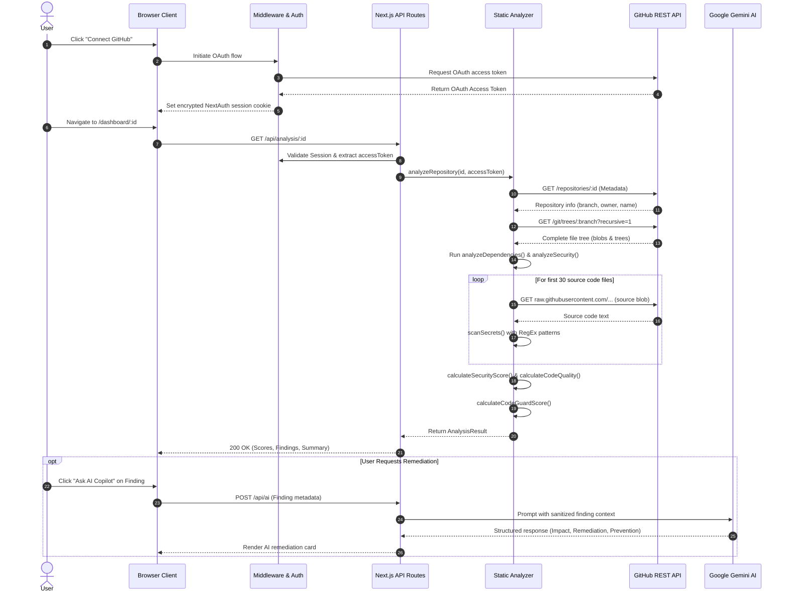

# CodeGuard AI — Technical Architecture & System Documentation

## 1. Executive Summary
**CodeGuard AI** is a developer security copilot and repository intelligence platform. Built on Next.js 15 (App Router), React 19, and Tailwind CSS, it provides automated static security analysis, repository hygiene scoring, dependency inspection, credential leak detection, and on-demand AI remediation via Google's Gemini generative models.

---

## 2. Technology Stack & Dependencies

| Layer | Framework / Library | Version | Purpose |
| :--- | :--- | :--- | :--- |
| **Framework** | Next.js (App Router) | `15.5.0` | Server-Side Rendering (SSR), Static Generation, API Route Handlers |
| **UI Library** | React / React DOM | `19.1.0` | Component lifecycle, client state hydration |
| **Authentication** | NextAuth.js | `4.24.15` | GitHub OAuth authentication, encrypted JWT sessions |
| **AI Generation** | `@google/generative-ai` | `0.24.1` | Gemini 1.5 Flash integration for remediation advice |
| **Typography & Icons** | Geist & Lucide React | `1.7.2` / `0.468.0` | Design system iconography and typography |
| **Styling Engine** | Tailwind CSS / PostCSS | `v4` | Utility-first CSS and layout styling |
| **Language** | TypeScript | `v5` | End-to-end type safety and schema validation |

---

## 3. Repository Architecture & File Mapping

```
codeguard-phase3/
├── src/
│   ├── app/
│   │   ├── api/
│   │   │   ├── ai/
│   │   │   │   └── route.ts                  # POST: AI remediation endpoint (Gemini integration)
│   │   │   ├── analysis/
│   │   │   │   └── [id]/
│   │   │   │       └── route.ts              # GET: Triggers repository scanner for a repo ID
│   │   │   ├── auth/
│   │   │   │   └── [...nextauth]/
│   │   │   │       └── route.ts              # GET/POST: NextAuth OAuth handler
│   │   │   └── repositories/
│   │   │       └── route.ts                  # GET: Lists user's accessible GitHub repos
│   │   ├── dashboard/
│   │   │   ├── [id]/
│   │   │   │   └── page.tsx                  # Repository analysis results, metrics, & insights view
│   │   │   ├── error.tsx                      # Dashboard error boundary
│   │   │   ├── loading.tsx                    # Dashboard loading skeleton
│   │   │   └── page.tsx                       # Dashboard repository listing & launcher
│   │   ├── globals.css                        # CSS variables, animations, glassmorphism tokens
│   │   ├── layout.tsx                         # Global HTML layout, metadata, command palette & cursor
│   │   ├── page.tsx                           # Landing page & feature showcase
│   │   └── template.tsx                       # Page transition wrapper
│   ├── components/
│   │   ├── effects/
│   │   │   ├── AICore.tsx                     # Dynamic glowing 3D-effect canvas
│   │   │   ├── AuroraBackground.tsx           # Ambient background gradient animation
│   │   │   └── ParticleField.tsx              # Interactive particle swarm canvas
│   │   └── ui/
│   │       ├── ActivityFeed.tsx               # Derived execution log & recap component
│   │       ├── CommandPalette.tsx             # Global Ctrl+K quick navigation modal
│   │       ├── CountUp.tsx                    # Smooth counter animation utility
│   │       ├── CustomCursor.tsx               # Fluid pointer follow & glow effect
│   │       ├── MagneticLink.tsx               # Physics-based hover attraction link
│   │       ├── RepositoryGraph.tsx            # Node distribution graph of repo files
│   │       ├── ScanProgress.tsx               # Multi-stage scan progress tracker
│   │       ├── SecurityRadar.tsx              # SVG radar visualization of threat categories
│   │       ├── SpotlightCard.tsx              # Mouse-tracking radial gradient card
│   │       └── ThreatHeatmap.tsx              # Severity-stratified threat grid
│   ├── hooks/
│   │   └── useMagnetic.ts                     # React hook calculating cursor magnetic physics
│   ├── lib/
│   │   ├── auth.ts                            # NextAuth GitHub provider & JWT callbacks
│   │   └── analyzer/
│   │       ├── dependencies.ts                # Package manifest & lockfile presence check
│   │       ├── github.ts                      # GitHub API tree recursion and blob fetcher
│   │       ├── index.ts                       # Analysis orchestrator combining all sub-analyzers
│   │       ├── quality.ts                     # Code health heuristics (tests, docs, ignore rules)
│   │       ├── scoring.ts                     # Weighted security and quality score calculations
│   │       ├── secrets.ts                     # Regex pattern matcher for exposed API keys & tokens
│   │       ├── security.ts                    # File-path scanner for sensitive files & oversized blobs
│   │       └── types.ts                       # TypeScript interfaces (Finding, Scores, AnalysisResult)
│   └── middleware.ts                          # Next.js route guard protecting /dashboard/* routes
```

---

## 4. End-to-End Operational Workflow



---

## 5. Subsystem Deep Dive

### 5.1 Authentication & Authorization
- **Location**: [src/lib/auth.ts](file:///c:/Users/zoro/OneDrive/Documents%20-%20Copy/placement%20prep/code%20gaurd%20ai%20claude/codeguard-phase3/src/lib/auth.ts) & [src/middleware.ts](file:///c:/Users/zoro/OneDrive/Documents%20-%20Copy/placement%20prep/code%20gaurd%20ai%20claude/codeguard-phase3/src/middleware.ts)
- **Mechanism**:
  - Implements `GitHubProvider` through NextAuth.
  - Intercepts OAuth token via the `jwt` callback and persists `account.access_token` into the session token.
  - The `session` callback passes `accessToken` directly to authenticated requests.
  - Route middleware intercepts `/dashboard/:path*`, redirecting unauthenticated users to the GitHub sign-in page.

---

### 5.2 Analysis & Heuristic Engine
The analysis pipeline located under [`src/lib/analyzer/`](file:///c:/Users/zoro/OneDrive/Documents%20-%20Copy/placement%20prep/code%20gaurd%20ai%20claude/codeguard-phase3/src/lib/analyzer/) executes in five coordinated phases:

#### Phase 1: Repository & Tree Ingestion
- Reads repository metadata and default branch.
- Queries GitHub Git Database API (`/git/trees/{branch}?recursive=1`) to obtain an exhaustive list of file paths and sizes in a single HTTP roundtrip.

#### Phase 2: Sensitive Files & Blob Analysis
- Evaluates paths against sensitive patterns:
  - Cryptographic files: `.pem`, `.key`, `.p12`, `.pfx`, `.crt`, `.cer`, `.jks`
  - SSH keys: `id_rsa`, `id_dsa`
  - Database dumps & credentials: `.sql`, `.db`, `.sqlite`, `.bak`, `.env`
  - Blob size check: Flags files $> 5\text{ MB}$.

#### Phase 3: In-Depth Secret Scanning
Fetches up to 30 primary source files (`.js`, `.jsx`, `.ts`, `.tsx`, `.java`, `.py`, `.c`, `.cpp`, `.cs`) via `raw.githubusercontent.com` and scans against regex signatures:
- **GitHub Tokens**: `gh[pousr]_[A-Za-z0-9]{36,}`
- **OpenAI API Keys**: `sk-[A-Za-z0-9]{32,}`
- **Google API Keys**: `AIza[0-9A-Za-z-_]{35}`
- **AWS Access Keys**: `AKIA[0-9A-Z]{16}`
- **JWT & Password Declarations**: Pattern matched variable assignments.

#### Phase 4: Dependency & Manifest Audit
- Checks for package descriptors (`package.json`, `pom.xml`, `requirements.txt`, `Cargo.toml`, `go.mod`, etc.).
- Verifies reproducible build integrity by checking for lockfiles (`package-lock.json`, `pnpm-lock.yaml`, `yarn.lock`, `poetry.lock`).

#### Phase 5: Code Quality & Health Heuristics
Calculates project health indicators:
- Deducts 10 points if `README.md` is missing.
- Deducts 10 points if `.gitignore` is missing.
- Measures test ratio: $\frac{\text{Test Files}}{\text{Source Files}}$. Deducts 20 points if $< 10\%$, or 10 points if $< 25\%$.

---

### 5.3 Scoring Algorithm Formulae

$$\text{Security Score} = \max\Big(0,\; 100 - (20 \times N_{\text{High}}) - (10 \times N_{\text{Medium}}) - (3 \times N_{\text{Low}})\Big)$$

$$\text{Code Quality Score} = \text{clamp}_{[0, 100]}\Big(100 - \Delta_{\text{README}} - \Delta_{\text{GitIgnore}} - \Delta_{\text{TestCoverage}}\Big)$$

$$\text{Overall CodeGuard Score} = \text{round}\Big(0.60 \times \text{Security Score} + 0.40 \times \text{Code Quality Score}\Big)$$

---

### 5.4 AI Remediation Engine (Gemini 1.5 Flash)
- **Location**: [src/app/api/ai/route.ts](file:///c:/Users/zoro/OneDrive/Documents%20-%20Copy/placement%20prep/code%20gaurd%20ai%20claude/codeguard-phase3/src/app/api/ai/route.ts)
- **Security Sanitization**: Strips dangerous characters and limits input strings to prevent prompt injection attacks.
- **Output Schema**: Returns a 3-part structured analysis:
  1. **Impact**: Exact security risk explanation in context.
  2. **Remediation**: Step-by-step code and config fix instructions.
  3. **Prevention**: CI/CD and policy-level preventive controls.

---

## 6. API Specifications

### `GET /api/repositories`
- **Auth Required**: Yes (`session.accessToken`)
- **Description**: Returns all accessible GitHub repositories sorted by update date.
- **Response**:
```json
{
  "repositories": [
    {
      "id": 123456,
      "name": "my-project",
      "fullName": "user/my-project",
      "description": "Example repository",
      "url": "https://github.com/user/my-project",
      "language": "TypeScript",
      "updatedAt": "2026-08-16T10:00:00Z",
      "private": false
    }
  ]
}
```

### `GET /api/analysis/:id`
- **Auth Required**: Yes (`session.accessToken`)
- **Description**: Executes the end-to-end repository scan and scoring pipeline.
- **Response**:
```json
{
  "repository": {
    "id": 123456,
    "name": "my-project",
    "fullName": "user/my-project"
  },
  "summary": {
    "totalFiles": 142,
    "sourceFiles": 84,
    "dependencyFiles": 2,
    "sensitiveFiles": 1,
    "largeFiles": 0
  },
  "scores": {
    "codeGuardScore": 88,
    "securityScore": 80,
    "codeQuality": 100
  },
  "findings": [
    {
      "severity": "High",
      "title": "GitHub Token",
      "description": "GitHub Token detected in source code.",
      "file": "src/config.ts"
    }
  ]
}
```

### `POST /api/ai`
- **Auth Required**: Yes (`session.accessToken`)
- **Body Payload**:
```json
{
  "findingTitle": "GitHub Token",
  "findingDescription": "GitHub Token detected in source code.",
  "findingSeverity": "High",
  "repoName": "my-project",
  "file": "src/config.ts"
}
```
- **Response**:
```json
{
  "insight": "1. **Impact**: Exposed personal access tokens allow unauthorized repository access...\n2. **Remediation**: Revoke the token immediately...\n3. **Prevention**: Implement pre-commit hooks...",
  "timestamp": "2026-08-16T10:52:00.000Z"
}
```

---

## 7. UI & Visualization Components

| Component | File Path | Interaction & Visual Behavior |
| :--- | :--- | :--- |
| **CommandPalette** | [`src/components/ui/CommandPalette.tsx`](file:///c:/Users/zoro/OneDrive/Documents%20-%20Copy/placement%20prep/code%20gaurd%20ai%20claude/codeguard-phase3/src/components/ui/CommandPalette.tsx) | Global `Ctrl+K` dialog with filtered actions and page routing |
| **RepositoryGraph** | [`src/components/ui/RepositoryGraph.tsx`](file:///c:/Users/zoro/OneDrive/Documents%20-%20Copy/placement%20prep/code%20gaurd%20ai%20claude/codeguard-phase3/src/components/ui/RepositoryGraph.tsx) | Node diagram showing distribution across Source, Dependencies, Sensitive, and Large files |
| **SecurityRadar** | [`src/components/ui/SecurityRadar.tsx`](file:///c:/Users/zoro/OneDrive/Documents%20-%20Copy/placement%20prep/code%20gaurd%20ai%20claude/codeguard-phase3/src/components/ui/SecurityRadar.tsx) | SVG polygonal threat assessment across 5 security axes |
| **ThreatHeatmap** | [`src/components/ui/ThreatHeatmap.tsx`](file:///c:/Users/zoro/OneDrive/Documents%20-%20Copy/placement%20prep/code%20gaurd%20ai%20claude/codeguard-phase3/src/components/ui/ThreatHeatmap.tsx) | Color-coded severity tiles for immediate visual triage |
| **SpotlightCard** | [`src/components/ui/SpotlightCard.tsx`](file:///c:/Users/zoro/OneDrive/Documents%20-%20Copy/placement%20prep/code%20gaurd%20ai%20claude/codeguard-phase3/src/components/ui/SpotlightCard.tsx) | Mouse-tracking radial light glow on card borders |
| **AICore Canvas** | [`src/components/effects/AICore.tsx`](file:///c:/Users/zoro/OneDrive/Documents%20-%20Copy/placement%20prep/code%20gaurd%20ai%20claude/codeguard-phase3/src/components/effects/AICore.tsx) | HTML5 Canvas particle orb representing active AI computation |
| **ParticleField** | [`src/components/effects/ParticleField.tsx`](file:///c:/Users/zoro/OneDrive/Documents%20-%20Copy/placement%20prep/code%20gaurd%20ai%20claude/codeguard-phase3/src/components/effects/ParticleField.tsx) | Background ambient floating particle constellation |
| **CustomCursor** | [`src/components/ui/CustomCursor.tsx`](file:///c:/Users/zoro/OneDrive/Documents%20-%20Copy/placement%20prep/code%20gaurd%20ai%20claude/codeguard-phase3/src/components/ui/CustomCursor.tsx) | Lag-free hardware-accelerated glowing cursor follow |
